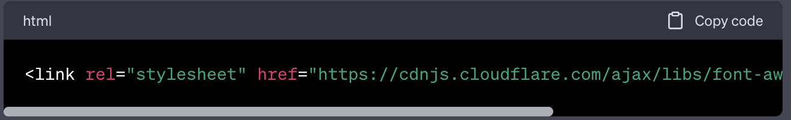
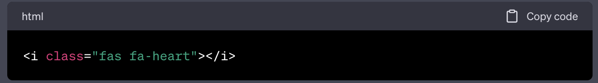
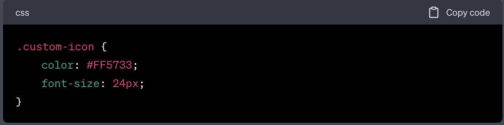
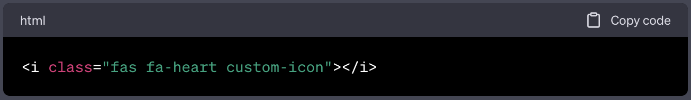

# Bootstrap-Portfolio

### Deployed link:
https://b-jibril.github.io/bootstrap-portfolio/

# Creating a Portfolio Using HTML, CSS And Bootstrap

## Using FontAwesome Icons in Your Project

FontAwesome is a popular icon library that provides a wide range of icons for use in web development projects. These icons are vector-based, easily scalable, and customizable using CSS. This guide will help you integrate FontAwesome icons into your project.

## Getting Started
##### 1. Include FontAwesome in Your Project:

To get started, include the FontAwesome CSS and font files in your project. You can do this by either downloading the files and linking to them locally, or by using a content delivery network (CDN) link. Here's an example of how to include FontAwesome using a CDN link:

##### 2. Choose an Icon:

Visit the FontAwesome website to browse and choose the icon you want to use. Each icon has a unique class associated with it, which you can use to display the icon.

## Displaying an Icon
#####  1. Add an Element for the Icon:

In your HTML markup, create an element (usually a <i> or  tag) to display the icon. Apply the appropriate FontAwesome class to this element. For example, if you want to display the "heart" icon, your HTML might look like this:

In this example, fas refers to the FontAwesome style (solid), and fa-heart is the specific class for the heart icon.

 ##### 2. Styling the Icon:

You can customize the appearance of the icon using CSS. FontAwesome icons can be styled like any other HTML element. Here's an example of how you might change the color and size of the icon:

Then, in your HTML:

## Advanced Usage
##### - Stacking Icons:

FontAwesome also provides the ability to stack icons on top of each other for creative effects. Check the FontAwesome documentation for detailed instructions on how to achieve this.

##### - Using Different Styles:

Besides solid icons `(fas)`, FontAwesome also offers regular (far), light `(fal)`, and brand (fab) styles. Choose the style that suits your project's design.

##### - Conclusion
Integrating FontAwesome icons into your project can enhance the visual appeal and user experience. By following the steps outlined in this guide, you'll be able to effortlessly add and style icons in your web applications. For more information and customization options, refer to the FontAwesome documentation.

